# Neural Brain Foundation Threat Model

- Status: Normative Foundation security baseline
- Version: 1.0
- Effective date: 2026-07-15
- Work item: FND-02.6
- Repository: `neural-brain`
- Scope: product- and domain-neutral platform architecture
- Related decisions: ADR-001 through ADR-014

## Overview

This threat model defines the initial repository-wide security and privacy
model for Neural Brain. It covers the planned runtime boundaries between
authenticated principals, untrusted requests and integrations, perception,
model inference, planning, policy, transition gates, execution, independent
verification, memory, PostgreSQL, audit, and external systems.

The repository is in the Foundation phase. This document describes required
controls and verification obligations; it does not claim that the controls are
already implemented, does not authorize productive processing, and is not a
security certification. Unknown, missing, stale, expired, conflicting,
malformed, unclassified, or unverifiable security-relevant state is denied by
default.

### Foundation and FND-04 boundary

This model identifies technical threats that are stable across potential uses,
including prompt and model manipulation, tool-output injection, confused-deputy
behavior, scope violations, unsafe external effects, automation bias, memory
poisoning, privacy loss, and control-plane compromise.

FND-04 MUST extend this model for each concrete deployment and intended use. It
owns the determination and evidence for regulatory roles, applicable AI Act
risk classification, the versioned prohibited- and unsupported-use catalog,
concrete fundamental-rights impacts, DPIA or other compliance assessments,
legal bases, accountable review authorities, and per-scope compliance release.
This Foundation model makes no legal applicability or regulatory-role
determination. Until those follow-on controls exist and a use is explicitly
released, productive tenants, areas, personal-data processing, and real
mutating tools remain disabled.

## Threat Model, Trust Boundaries, and Assumptions

### Protected assets

| ID | Asset | Required security property |
| --- | --- | --- |
| A-01 | Authenticated principal and runtime identity | Authenticity, freshness, non-substitutability, and separation of duties |
| A-02 | Immutable tenant, area, project, session, and goal scope | Integrity, isolation, provenance, and non-escalation |
| A-03 | Authority grants, snapshots, roles, and policy decisions | Integrity, bounded validity, context binding, and non-replay |
| A-04 | Approvals and separation-of-duties evidence | Request and payload binding, expiry, non-replay, and independence |
| A-05 | Goal, Action, and Memory protected state | Gate-only mutation, valid transitions, atomic audit, and recovery |
| A-06 | Budget reservations, resource claims, locks, and fencing tokens | Atomicity, uniqueness, monotonicity, and conservative settlement |
| A-07 | Dispatch journal, execution grants, attempts, and effect disposition | Persist-before-dispatch, monotonic evidence, and crash consistency |
| A-08 | Evidence packages and independent verification decisions | Integrity, provenance, completeness, and verifier independence |
| A-09 | Working memory, observations, checkpoints, candidates, and later memories | Scope isolation, provenance, freshness, stage control, and governed lifecycle |
| A-10 | PostgreSQL domain and audit ledgers | Transactional integrity, availability, recoverability, and least privilege |
| A-11 | Security Floor, policies, kill switches, and compliance-release state | Non-bypassability, integrity, freshness, and fail-closed behavior |
| A-12 | Tool adapters, operation contracts, and external systems | Authenticity, bounded capability, reconciliation, and egress control |
| A-13 | Local inference configuration, model identity, prompt, and response | Local-only routing, exact model binding, confidentiality, and untrusted-output handling |
| A-14 | Personal data, classified content, secrets, logs, indexes, caches, and derived artifacts | Minimization, confidentiality, purpose limitation, retention, and complete governed deletion |
| A-15 | Trace, correlation, causation, schema, artifact, and evidence identifiers | Integrity, uniqueness where required, and scope-correct linkage |
| A-16 | Startup, restore, backup, reconciliation, monitoring, and release evidence | Accuracy, completeness, durability, and safe readiness |

### Actors and input control

| Actor class | Examples | Control assumption |
| --- | --- | --- |
| Untrusted external actor | API caller, future product integration, webhook sender, content author | May submit malformed, deceptive, replayed, cross-scope, oversized, or adversarial content; never supplies trusted identity or scope |
| Authenticated but bounded actor | Tenant user, requester, approver, operator | May be malicious, compromised, mistaken, over-privileged, or operating with stale authority; authentication alone is not authorization |
| Untrusted computational source | Model response, prompt content, tool output, retrieved memory, database payload not proven by the current schema and transaction | May contain instructions, false claims, forged metadata, sensitive data, or adversarial structure; requires schema validation and provenance |
| Privileged runtime component | Policy engine, transition gate, executor, verifier, guardian, reconciler | Trusted only for its narrow port and identity; one component's privilege does not transfer to another |
| Developer and release actor | Contributor, dependency maintainer, migration author, CI or deployment operator | Can introduce code, configuration, dependency, schema, or release-evidence defects; changes require review, locked inputs, and verification |
| External dependency or system | Tool endpoint, identity provider, local Ollama service, operating system, PostgreSQL | May be unavailable, compromised, stale, misconfigured, or return ambiguous results; responses never expand authority |

### Trust-boundary diagram

```mermaid
flowchart LR
    subgraph U["Untrusted and external boundary"]
        Caller["Caller or future product integration"]
        Content["Prompt, document, event, or integration payload"]
        External["External tool or system"]
    end

    subgraph E["Authenticated ingress and trust-envelope boundary"]
        Auth["Authentication and trusted runtime context"]
        Validate["Schema validation and provenance capture"]
        Perception["Perception and Attention"]
    end

    subgraph C["Cognitive proposal boundary"]
        WM["Scoped Working Memory"]
        Prompt["Minimized same-area prompt assembly"]
        Ollama["Approved local Ollama adapter"]
        Planner["Planner"]
    end

    subgraph P["Security and protected-state boundary"]
        Floor["Security Floor and Policy Engine"]
        GoalGate["Goal Transition Gate"]
        ActionGate["Action Transition Gate"]
        MemoryGate["Memory Transition Gate"]
        Approval["Authority, approval, budget, claims, and fences"]
    end

    subgraph X["External-effect boundary"]
        Journal["Dispatch journal and execution attempt"]
        Executor["Serial Executor"]
        Adapter["Registered typed tool adapter"]
        Reconcile["Guardian and Reconciler"]
    end

    subgraph V["Independent completion boundary"]
        Evidence["Evidence Package"]
        Verifier["Independent Verifier"]
    end

    subgraph D["Authoritative persistence boundary"]
        DB[("PostgreSQL protected state and audit")]
    end

    Caller --> Auth
    Content --> Validate
    Auth --> Validate
    Validate --> Perception
    Perception --> WM
    WM --> Planner
    WM --> Prompt
    Prompt --> Ollama
    Ollama -->|"untrusted response"| Validate
    Planner -->|"typed proposal only"| Floor
    Floor --> GoalGate
    Floor --> ActionGate
    Approval --> ActionGate
    GoalGate --> DB
    ActionGate --> DB
    MemoryGate --> DB
    ActionGate --> Journal
    Journal --> Executor
    Executor --> Adapter
    Adapter --> External
    External -->|"untrusted or ambiguous result"| Validate
    Executor --> Evidence
    Evidence --> Verifier
    Verifier -->|"decision, not state write"| GoalGate
    Reconcile --> ActionGate
    DB --> Reconcile
    Reconcile --> DB
```

The arrows describe permitted information or typed-request flow, not direct
write permission. Only the Goal, Action, and Memory Transition Gates may write
their protected state. Every protected mutation and its audit record commit in
one PostgreSQL transaction.

### Trust boundaries

| ID | Boundary | Inbound trust decision |
| --- | --- | --- |
| TB-01 | External caller to authenticated runtime | Authentication establishes principal; trusted runtime context establishes scope; payload fields cannot establish either |
| TB-02 | Untrusted payload to typed component port | Schema, size, provenance, classification, and purpose are validated before typed conversion; validation does not grant authority |
| TB-03 | Prompt or memory context to local inference | Only minimized, scope-correct content reaches the exact approved local endpoint and model; model output returns as untrusted input |
| TB-04 | Planner to Security Floor and transition gates | A plan is a proposal only; it cannot execute, approve, mutate, or satisfy evidence requirements |
| TB-05 | Policy and authority to Action Transition Gate | Every decision is current, immutable-context-bound, inside the Security Floor, and independently checked for replay and scope |
| TB-06 | Protected runtime to PostgreSQL | Dedicated roles and explicit transactions enforce gate-only writes, row isolation, atomic audit, and short transaction boundaries |
| TB-07 | Committed action to executor and adapter | Dispatch requires durable journal, grant, attempt, valid fence, permissive kill switch, and a registered operation contract |
| TB-08 | Adapter to external system and back | External outcome is untrusted and may be ambiguous; reconciliation strategy determines disposition without blind retry |
| TB-09 | Execution evidence to independent verifier | Verifier identity and evidence sources remain separate from executor; success signals alone cannot prove achievement |
| TB-10 | Memory candidate to active memory | Stage and Memory Gate controls prevent early or unauthorized promotion; sensitive promotion requires independent authority |
| TB-11 | Area to another area | Denied until a later explicit audited handover contract exists; raw Working Memory never crosses this boundary |
| TB-12 | Build, deployment, restore, and startup to ready runtime | Locked artifacts, approved configuration, backup/restore evidence, and completed reconciliation precede readiness |

### Security objectives and invariant assumptions

1. Principal and immutable scope originate only from authenticated runtime
   context; every persisted domain object contains `tenant_id` and `area_id`,
   plus `project_id` when project-bound.
2. Prompts, model responses, tool output, integration payloads, request bodies,
   and untrusted stored data cannot set or change scope, identity, roles,
   authority, approval, policy, risk classification, compliance release, or kill
   switches.
3. The Security Floor is code-defined and cannot be overridden by policy or
   approval. Unknown security-relevant state is denied.
4. Planner, model, prompt, skill, verifier, executor, guardian, and adapter
   cannot directly mutate protected state or bypass a transition gate.
5. No external effect occurs without the complete committed authorization and
   resource contract. Ambiguity becomes `indeterminate`; associated claims stay
   held until the effect is safely resolved.
6. Executor success is not goal success. `Achieved` requires independent
   verification, complete evidence, and quiescence through the Goal Gate.
7. Stage capabilities are cumulative and fail closed. Configuration cannot
   enable a later-stage capability early.
8. PostgreSQL is authoritative for protected state and audit. Logs, model
   interpretation, caches, and external systems cannot reconstruct or override
   the ledger after a crash.
9. Local Ollama is the only approved inference provider. The exact endpoint and
   model identity are trusted deployment configuration; no OpenAI, external
   model API, compatibility endpoint, or automatic cloud fallback is permitted.
10. Productive activation remains denied until the later purpose,
    classification, regulatory, privacy, and per-scope compliance-release
    controls are implemented and current.

### Environmental assumptions and limits

- Authentication, operating-system isolation, PostgreSQL hardening, local
  network controls, secret provisioning, and physical security are deployment
  dependencies whose concrete design is not yet present in Foundation.
- A fully compromised host or database superuser can defeat application-layer
  controls. The required response is prevention through deployment hardening
  plus detectable integrity, reconciliation, backup, restore, and incident
  evidence; this document does not assume application code can contain an
  all-powerful host administrator.
- Denial of service against an unavailable external system cannot always be
  prevented. The platform must bound resource consumption and fail closed
  without converting availability pressure into authorization or unsafe retry.
- Human approvers, verifiers, and incident resolvers can err or collude. Runtime
  identity separation, least privilege, evidence binding, and audit reduce this
  risk; deployment-specific staffing and accountability are FND-04 and later
  operational concerns.

## Attack Surface, Mitigations, and Attacker Stories

### Threat catalog

| ID | Threat and attacker story | Primary assets | Required mitigation | Required verification |
| --- | --- | --- | --- | --- |
| T-01 | A caller forges `tenant_id`, `area_id`, `project_id`, or principal fields in a request, prompt, model response, tool result, or integration message to read or mutate another scope. | A-01, A-02, A-05, A-09, A-10 | M-01, M-02, M-07 | V-01, V-02, V-06 |
| T-02 | Prompt injection or retrieved adversarial content instructs the model or planner to ignore policy, reveal data, select tools, alter scope, or claim success. | A-02, A-05, A-09, A-11, A-13, A-14 | M-02, M-03, M-04, M-10 | V-01, V-03, V-09, V-10 |
| T-03 | A model hallucinates authority, evidence, a successful effect, or a safe reconciliation result and downstream code treats it as trusted fact. | A-03, A-05, A-07, A-08, A-13 | M-02, M-03, M-06, M-09 | V-03, V-07, V-09, V-12 |
| T-04 | Inference configuration is redirected to OpenAI, another cloud API, a public endpoint, an unapproved local model, or an automatic fallback, exposing scoped data and changing behavior. | A-11, A-13, A-14 | M-03, M-12 | V-08, V-15 |
| T-05 | A malicious or compromised tool returns forged scope, instructions, HTML, code, file paths, oversized data, or false success that is trusted by the runtime or verifier. | A-02, A-05, A-08, A-12, A-14 | M-02, M-05, M-09, M-13 | V-01, V-05, V-09, V-12 |
| T-06 | The planner, model, skill, or another proposal component invokes a tool or writes protected state directly, bypassing policy, claims, audit, or the Action Gate. | A-03, A-05, A-06, A-07, A-11, A-12 | M-04, M-05, M-07 | V-03, V-04, V-05, V-06 |
| T-07 | A confused deputy uses valid service privileges for a caller, scope, purpose, or operation not covered by the caller's current authority. | A-01, A-02, A-03, A-05, A-12 | M-01, M-04, M-05 | V-02, V-03, V-05 |
| T-08 | An approval is replayed, substituted onto another payload or scope, reused after expiry, or treated as a source of authority. | A-03, A-04, A-05, A-15 | M-04, M-05 | V-03, V-05 |
| T-09 | Policy configuration weakens the Security Floor, a stale policy or authority snapshot is accepted, or a kill switch is bypassed between preparation, commit, and dispatch. | A-03, A-05, A-11 | M-04, M-05, M-11 | V-03, V-05, V-14 |
| T-10 | Concurrent or repeated preparation double-reserves budget, creates duplicate claims, accepts a stale fence, or permits negative accounting. | A-05, A-06, A-10 | M-05, M-07 | V-05, V-06, V-07 |
| T-11 | A crash before or after a commit or external call leaves an effect unrecorded, dispatches twice, releases claims too early, or causes blind retry of a non-idempotent operation. | A-06, A-07, A-10, A-12, A-16 | M-05, M-06, M-07, M-11 | V-05, V-07, V-14 |
| T-12 | An adapter reports timeout or failure although the effect may have occurred; automated recovery assumes no effect and repeats it. | A-06, A-07, A-12 | M-05, M-06 | V-05, V-07 |
| T-13 | A general application role, migration, administrative endpoint, or maintenance tool directly edits protected tables or separates a transition from its audit event. | A-05, A-06, A-10, A-16 | M-07, M-11 | V-06, V-07, V-14 |
| T-14 | Startup or restore reports ready before reconciliation, allowing work while attempts, claims, stale fences, or indeterminate effects remain unresolved. | A-06, A-07, A-10, A-16 | M-06, M-11 | V-07, V-14 |
| T-15 | The executor supplies or selects the evidence used to verify its own success, or a tool's HTTP status or exit code is accepted as proof that a goal is achieved. | A-05, A-08 | M-09 | V-04, V-12 |
| T-16 | Poisoned observations or memory candidates become durable truth, cross scopes, evade provenance and freshness checks, or activate a Stage 2 or Stage 3 capability during Stage 1. | A-02, A-09, A-11, A-14 | M-02, M-08, M-10 | V-01, V-02, V-10 |
| T-17 | Retrieval exposes another area, stale or revoked knowledge drives action, or raw Working Memory crosses an area boundary. | A-02, A-09, A-14 | M-01, M-08, M-10 | V-02, V-10 |
| T-18 | Personal or sensitive data, prompts, responses, secrets, credentials, raw audit payloads, or unrelated memory are copied into model context, logs, evidence, indexes, caches, or telemetry. | A-09, A-13, A-14 | M-03, M-10, M-12, M-13 | V-08, V-10, V-11 |
| T-19 | Retention, correction, anonymization, or deletion removes only the primary row while embeddings, indexes, caches, derived artifacts, backups, or reconstructive audit content remain. | A-09, A-10, A-14, A-16 | M-10, M-11 | V-11, V-14 |
| T-20 | A spoofed, replayed, duplicated, delayed, or reordered integration message creates a false event, crosses scope, or causes repeated processing. | A-01, A-02, A-05, A-12, A-15 | M-01, M-02, M-05, M-13 | V-01, V-02, V-05, V-09 |
| T-21 | Persuasive model output manipulates a person, conceals uncertainty, pressures an approver, or frames options to induce an unsafe decision. | A-04, A-08, A-11, A-13 | M-03, M-09, M-14 | V-12, V-13 |
| T-22 | Automation bias causes an operator or verifier to accept model or tool recommendations without independent evidence, meaningful review, or awareness of limitations. | A-04, A-08, A-11, A-13 | M-09, M-14 | V-12, V-13 |
| T-23 | A privileged operator combines requester, approver, policy activator, executor, verifier, promoter, or incident-resolver powers and suppresses contrary audit evidence. | A-01, A-03, A-04, A-05, A-08, A-10, A-11 | M-04, M-07, M-09, M-11 | V-04, V-06, V-12, V-14 |
| T-24 | Resource exhaustion through large prompts, tool output, repeated proposals, expensive inference, unresolved claims, or event floods degrades availability or forces unsafe control bypass. | A-06, A-10, A-12, A-13, A-16 | M-02, M-05, M-11, M-12, M-13 | V-01, V-05, V-08, V-14 |
| T-25 | A compromised dependency, build input, model artifact, migration, or deployment configuration introduces a bypass or silently changes the approved runtime. | A-10, A-11, A-12, A-13, A-16 | M-11, M-12, M-15 | V-06, V-08, V-14, V-15 |
| T-26 | A deployment activates an unclassified, prohibited, unsupported, or purpose-incompatible use and treats the neutral platform architecture as regulatory authorization. | A-11, A-14, A-16 | M-04, M-14, M-16 | V-13, V-15 |
| T-27 | Server-side conversation reuse, prompt or response caching, or inference batching carries Working Memory or model context into another request, tenant, area, project, session, or goal. | A-02, A-09, A-13, A-14 | M-01, M-03, M-08, M-12 | V-02, V-08, V-10 |

### Mitigation catalog

| ID | Technical mitigation |
| --- | --- |
| M-01 | Derive principal and immutable hierarchical scope only from authenticated runtime context; enforce scope at typed ports, gates, PostgreSQL roles, row policies, and retrieval. Reject mismatches before mutation or disclosure. |
| M-02 | Apply bounded runtime schema validation, provenance capture, data classification, size limits, and a Trust Envelope at every untrusted boundary. Keep payload values separate from trusted control context. |
| M-03 | Treat prompts, model context, and model responses as untrusted data. Minimize context, preserve source labels, prohibit model-supplied control state, require typed validation before downstream use, and prohibit cross-scope conversation reuse, caching, or batching. |
| M-04 | Enforce non-overridable Security Floor rules, versioned and expiring policy decisions, scoped authority, runtime separation of duties, and default deny for unknown state, actor, purpose, operation, risk, or compliance status. |
| M-05 | Route all external effects through the Action Transition Gate and the complete authorization, approval, budget, resource, fence, kill-switch, and atomic-audit contract. Bind approvals against replay and payload substitution. |
| M-06 | Persist intent, dispatch journal, execution grant, and monotonic attempt before adapter invocation. Declare idempotency, reconciliation, and compensation per operation. Preserve `indeterminate` without blind retry or premature release. |
| M-07 | Use PostgreSQL as authoritative ledger with explicit short transactions, gate-specific database roles, row isolation, constraints, atomic audit, monotonic fences, guarded migrations, and no general direct write path. |
| M-08 | Enforce the Stage Capability Matrix and Memory Transition Gate. Keep Stage 1 candidates inactive, require provenance and freshness later, and prohibit cross-area retrieval or promotion without the later explicit contract. |
| M-09 | Keep executor and verifier identities, ports, evidence sources, and permissions separate. Require machine-readable criteria, complete evidence, quiescence, and Goal Gate authorization before `Achieved`. |
| M-10 | Bind every data path to classification, purpose, scope, provenance, retention, and deletion responsibility. Propagate authorized deletion or anonymization to reconstructive derivatives and retain only non-reconstructive audit evidence. |
| M-11 | Reconcile before startup or restore readiness; verify backups and restores; detect stale fences, incomplete transitions, orphaned claims, unfinished attempts, and ambiguous effects; monitor security and safety invariants. |
| M-12 | Bind inference to the approved local Ollama adapter, exact non-public endpoint, model ID, version, digest, timeout, budget, minimized logging, and denied public egress. Reject OpenAI, compatibility mode, cloud credentials, external providers, and fallback. |
| M-13 | Register typed tool and integration contracts with explicit operation identity, authentication, input/output schemas, bounds, timeouts, replay controls, egress destinations, data classes, and reconciliation behavior. |
| M-14 | Surface uncertainty, limitations, evidence source, automation status, and required human review. Do not use persuasive model text as approval or verification evidence. Bind productive use to an intended-purpose and human-oversight contract. |
| M-15 | Pin runtime and dependencies, verify model artifacts and deployment configuration, review migrations and policy activation separately, scan for secrets, and preserve immutable build and release evidence. |
| M-16 | Deny productive activation until FND-04 provides current, scope-matched purpose, applicability, role, classification, prohibited-use, fundamental-rights, privacy, accountable-review, and compliance-release evidence. |

### Verification catalog

| ID | Minimum verification evidence |
| --- | --- |
| V-01 | Positive and negative schema tests plus property-based malformed, oversized, unknown-field, forged-control-field, and provenance tests for every untrusted boundary |
| V-02 | Actor, authority, tenant, area, project, session, goal, cross-scope, cross-area, and retrieval-isolation tests proving payload-supplied scope is ignored or rejected |
| V-03 | Complete transition-table tests for allowed and forbidden actors, purposes, guards, policy decisions, expiry, unknown values, quiescence, audit failure, and recovery |
| V-04 | Runtime port, identity, database-role, and permission tests proving planner/executor/verifier/requester/approver/policy/promoter/resolver separation |
| V-05 | External-effect tests for missing authorization elements, approval replay, payload substitution, double reservation, concurrent request, stale fence, kill switch, cancellation, timeout, retry, and conservative settlement |
| V-06 | PostgreSQL constraint, role, row-isolation, gate-only write, migration, transaction, concurrency, negative-balance, duplicate-claim, and atomic-audit tests |
| V-07 | Deterministic failure injection before and after every commit and dispatch boundary, including indeterminate outcomes, restart, reconciliation, and no blind retry |
| V-08 | Local inference configuration tests proving exact model identity and digest, endpoint restriction, budget and timeout enforcement, payload-minimized logs, denied public egress, no OpenAI or cloud fallback path, request-scoped prompt assembly, and no cross-scope cache, batch, or conversation reuse |
| V-09 | Adversarial prompt, model-response, tool-output, integration-message, false-success, injected-instruction, and evidence-forgery tests |
| V-10 | Stage-capability, memory provenance, freshness, candidate inactivity, promotion denial, scope-safe retrieval, and cross-area Working Memory denial tests |
| V-11 | Data-flow inventory and tests for minimization, purpose binding, secret exclusion, retention, legal hold, resumable deletion, anonymization, and derivative/index/cache cleanup |
| V-12 | Independent verification tests proving executor or tool success cannot reach `Achieved`, evidence criteria are complete, verifier identity is distinct, and blocked verification cannot bypass completion guards |
| V-13 | Foundation contract review plus later FND-04 use-case tests for intended-purpose mismatch, unsupported or prohibited use, manipulation and automation-bias controls, human oversight, reassessment triggers, and compliance-release denial |
| V-14 | Startup, restore, backup, readiness, monitoring, alerting, stale-state, reconciliation, and critical-runbook evidence with fail-closed health and safety signals |
| V-15 | Locked clean-checkout build, dependency and secret scan, migration review, configuration validation, ADR/contract consistency, threat-model coverage, and immutable release-evidence checks |

### Realistic attacker stories

- A bounded tenant user embeds instructions in a document or request that ask
  the model to act as an administrator and send data to a tool. This is realistic
  wherever prompts contain user-controlled content; the defense is architectural
  non-authority of model output, not a claim that prompt injection can be
  perfectly filtered.
- A tool accepts an action but the network times out before the executor receives
  confirmation. This is an expected failure mode, not an edge case. The safe
  result is `indeterminate`, held claims, and declared reconciliation rather than
  a retry based on availability pressure.
- An authenticated user copies another area's identifier into a payload. This is
  realistic even without database compromise. Trusted runtime scope and
  database isolation must make the identifier ineffective.
- A privileged operator accidentally activates a stale policy or combines
  requester and approver roles. This is realistic operational error; technical
  identity separation, expiry, policy digests, and audit must prevent or expose
  it.
- A local inference endpoint or model tag changes after deployment. This is
  realistic configuration drift. Exact endpoint and model-digest verification
  must fail readiness rather than select an available alternative.
- A polished model explanation causes a reviewer to accept an unsupported
  conclusion. This is realistic automation bias. Independent source evidence,
  explicit uncertainty, human oversight, and role separation must remain
  mandatory.

### Deferred or out-of-scope attacker stories

- Product-specific abuse cases, affected-person analysis, sector obligations,
  concrete fundamental-rights impacts, and prohibited-use determinations are not
  knowable from the neutral repository alone. They are mandatory FND-04 inputs,
  not waived risks.
- Total compromise of the host, hypervisor, hardware root of trust, PostgreSQL
  superuser, or CI administrator is outside the containment claim of the
  application architecture. Deployment hardening, credential management,
  provenance, detection, backup, restore, and incident response must address
  those threats before production.
- Social engineering that occurs wholly outside Neural Brain's interfaces is not
  directly controlled here. Any system-generated recommendation, approval
  request, or operator interface remains in scope for manipulation and
  automation-bias controls.
- Stage 2 through Stage 4 attack surfaces are included at the architectural
  boundary level, but their concrete APIs, distributed protocols, and storage
  paths require updated threat analysis before their stage gates can pass.

## Release Stops and Security Acceptance

The following conditions stop implementation of the affected capability and
stop release of any dependent stage:

1. Scope or principal can originate from untrusted input, or cross-scope access
   is possible.
2. A protected state can be changed outside its transition gate or without its
   atomic audit record.
3. A forbidden or unknown transition, actor, purpose, tool, operation, risk,
   data class, policy, or compliance state is accepted.
4. Planner, model, skill, verifier, executor, guardian, or adapter can bypass
   the typed request and gate path.
5. An external effect can execute without the complete committed authorization
   and resource contract.
6. Approval replay, payload substitution, stale authority, negative or duplicate
   budget, duplicate claims, stale fencing, or kill-switch bypass is possible.
7. A non-idempotent or ambiguous effect can be retried automatically, or its
   budget, claim, or lock can be released before safe disposition.
8. `Achieved` is reachable without independent verification, complete evidence,
   and quiescence.
9. Model or tool output can determine control state, or inference can reach an
   external provider, OpenAI, an unapproved model, or automatic fallback.
10. Stage 1 can activate later-stage memory, scheduling, handover, or distributed
    execution capabilities.
11. Personal data lacks classification, purpose, scope, retention, or deletion
    responsibility; secrets can enter prompts, memory, logs, audit, or evidence;
    or governed deletion leaves reconstructive derivatives.
12. Startup or restore can report ready before reconciliation, a critical
    runbook is absent, or backup and restore have not been proven.
13. Productive use can activate without current scope-matched purpose,
    classification, regulatory, privacy, human-oversight, and compliance-release
    evidence once the owning FND-04 mechanisms exist; until then, productive use
    remains disabled.
14. A critical or high threat in this model lacks an implemented mitigation and
    objective verification evidence for the stage being released.

Controls inherited from a later stage, policy exception, operator approval, or
availability workaround cannot waive a release stop.

## Severity Calibration

Severity is based on achievable impact, required attacker position, affected
scope, external-effect reversibility, detectability, and recovery evidence. A
design obligation is not evidence that a vulnerability currently exists.

### Critical

A realistic path can cause broad or irreversible harm, systemic cross-tenant
compromise, uncontrolled privileged external effects, or loss of the
authoritative safety controls with little additional access.

Examples include unauthenticated cross-tenant protected-state mutation; a model
or prompt directly dispatching privileged tools; a universal Security Floor or
kill-switch bypass; automatic cloud exfiltration of broadly scoped sensitive
data; or database permissions that let the general runtime rewrite protected
state and audit history across tenants.

### High

A realistic bounded actor can create a material unauthorized effect, expose
sensitive data, defeat independent verification, or make an ambiguous effect
unsafe, but exploitation is limited to a tenant, area, privileged role, or
specific operation.

Examples include approval replay for a mutating action; cross-area retrieval;
automatic retry of an indeterminate payment-like operation; acceptance of stale
fencing; forged evidence reaching `Achieved`; incomplete deletion of sensitive
derivatives; or redirecting local inference to an external provider for one
area.

### Medium

The issue weakens defense in depth, exposes limited classified metadata,
degrades recoverability, or requires a privileged or narrow precondition without
providing a direct high-impact path by itself.

Examples include prompt bodies entering restricted operator logs for one scoped
session; failure to expire a non-mutating policy decision; missing resource
bounds that cause scoped denial of service; or a reconciliation alert that omits
an orphaned but non-effecting claim while readiness still remains false.

### Low

The issue has limited confidentiality, integrity, or availability impact and
does not cross a security boundary without additional independent weaknesses.

Examples include non-sensitive version metadata leakage, an imprecise but
non-security operational metric, or documentation drift that is caught by
automated contract tests before release. Pure style issues and hypothetical
attacks that require total host compromise without increasing the attacker's
existing power are not security findings.

## FND-04 Extension Requirements

Before any concrete deployment or productive use, the follow-on threat model
MUST add, at minimum:

1. the exact intended purpose, users, affected people, operating environment,
   benefit, limitations, external effects, and explicit non-goals;
2. deployment-specific data flows, data categories, sources, recipients,
   retention, legal basis evidence, and processor/controller or other role
   findings where applicable;
3. evidence-backed AI Act applicability and risk classification without
   inferring a role or class from this repository;
4. the current prohibited- and unsupported-use assessment and enforcement
   catalog;
5. concrete fundamental-rights, discrimination, accessibility, manipulation,
   deception, and automation-bias risks for affected people;
6. DPIA, conformity, transparency, human-oversight, incident, supplier, or other
   assessments where the qualified review determines they apply;
7. accountable owners, independent reviewers, validity periods, reassessment
   triggers, revocation, and scope-bound compliance-release evidence; and
8. deployment-specific attack surfaces, credentials, networking, identity,
   observability, backup, restore, and incident-response verification.

Missing or inconclusive applicability evidence is a denial condition for
productive activation, not permission to infer non-applicability.

Baseline: FND-02 product-neutral technical threat model
